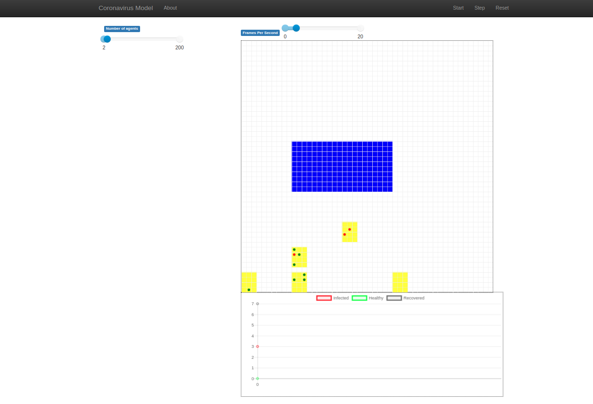

# covid agent simulation

# TODO:
* [ ] [Konrad] Create final map of the environment. Note: for visualisation purposes
we should have horizontal orientation friendly grid
rectangle rather than square. Also, cells should be smaller
that they're now. I think that houses also could be smaller.
* [x] [Adam] Setup probabilities from adequate distributions
* [ ] [Konrad] Add third type of space where agents can't go.
    * [ ] Create maps for each scenario (store, park, forest),
    it would be better if the houses were exactly the same in each scenario.
* [x] [Adam] Move part of existing parameters to config.
* [ ] [Konrad] Prepare short recording for designers,
possibly remove grid lines in javascript (locally).
* [ ] Add parameters to be setup by users
* [ ] Limit/Monitor number of agents in the common area 
* [ ] Tweak simulation parameters, especially decide how 1 tick
in the simulation is related to time in real world.
* [ ] Perform simulations with different scenarios.
Maybe we could collect data to files and make some actual comparisons
with statistics? 

## Environment preparation
`make build`

## Usage
### without docker
`mesa runserver .`

### with docker
1. `make dev`
2. `mesa runserver .`

## Screenshot

